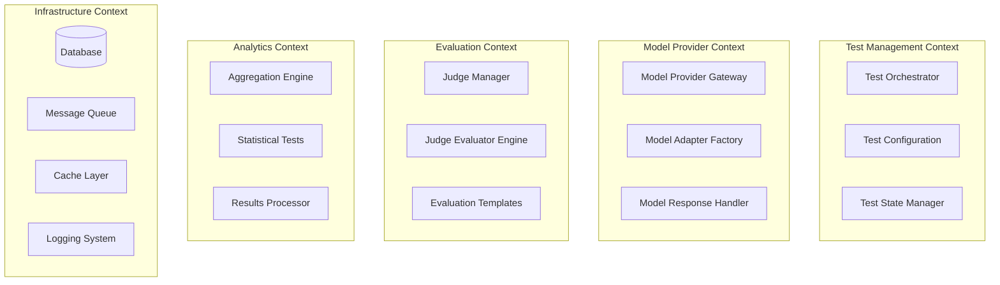

# AI Agent Specifications for LLM A/B Testing Platform

## 🎯 Project Overview

**Project Name**: LLM A/B Testing Platform  
**Architecture**: Domain-Driven Design (DDD) + Test-Driven Development (TDD)  
**Primary Goal**: Enterprise-grade platform for conducting A/B tests on Large Language Models with multi-judge evaluation

## 🏗️ System Architecture

### Bounded Contexts


### Domain Model Structure
```
src/
├── domain/
│   ├── test_management/          # Test lifecycle and orchestration
│   ├── model_provider/           # LLM provider abstractions
│   ├── evaluation/               # Judge system and evaluation logic
│   └── analytics/                # Statistical analysis and reporting
├── application/                  # Use cases and application services
├── infrastructure/               # External concerns (DB, APIs, etc.)
└── presentation/                 # API and UI layers
```

## 🔧 Development Methodology

### TDD Red-Green-Refactor Cycle
1. **RED**: Write failing test that captures requirement
2. **GREEN**: Implement minimal code to make test pass
3. **REFACTOR**: Improve code while keeping tests green
4. **VERIFY**: Validate integration and business rules
5. **INTEGRATE**: Ensure cross-domain compatibility

### Quality Gates (Each Phase)
- ✅ **Unit Tests**: >90% coverage for domain logic
- ✅ **Integration Tests**: Cross-boundary interactions
- ✅ **Contract Tests**: External API integrations
- ✅ **Architecture Tests**: DDD boundary enforcement
- ✅ **Performance Tests**: Response time <2s, throughput >100 req/s

## 📊 Technical Specifications

### Core Technologies
- **Backend**: FastAPI 0.104+ (async/await, dependency injection)
- **Database**: SQLAlchemy 2.0+ (async), Alembic migrations
- **Message Queue**: Celery + Redis (async task processing)
- **Testing**: Pytest + Factory Boy + Testcontainers
- **API Integration**: httpx (async HTTP client)
- **Frontend**: Streamlit (rapid prototyping, data visualization)

### External Integrations
- **OpenAI**: GPT-4, GPT-3.5-turbo via openai library
- **Anthropic**: Claude 3.5 Sonnet via anthropic library  
- **Google**: Gemini via google-generativeai library
- **Baidu**: Wenxin via custom HTTP client
- **Alibaba**: Qwen via custom HTTP client

### Performance Requirements
- **API Response**: <2s for test operations, <5s for complex analysis
- **Concurrent Tests**: Support 50+ parallel A/B tests
- **Judge Evaluation**: <10s per response evaluation
- **Statistical Analysis**: <30s for comprehensive reports
- **System Uptime**: >99.5% availability

## 🎯 Agent Task Specifications

### Phase 1: Domain Foundation (Agent Tasks 1-4)
**Duration**: 5 days | **Verification**: Unit tests + architecture tests

#### Task 1.1: Core Domain Entities
- **Location**: `src/domain/test_management/entities/`
- **Deliverables**: Test, TestConfiguration, TestSample, TestResult entities
- **Tests**: Entity behavior, invariants, value objects
- **Acceptance**: All business rules enforced, immutability where required

#### Task 1.2: Model Provider Domain  
- **Location**: `src/domain/model_provider/`
- **Deliverables**: Provider abstractions, model configurations, response handling
- **Tests**: Provider interface contracts, error handling
- **Acceptance**: Extensible provider system with consistent API

#### Task 1.3: Evaluation Domain
- **Location**: `src/domain/evaluation/`
- **Deliverables**: Judge interfaces, evaluation templates, consensus algorithms
- **Tests**: Judge consistency, template validation, scoring algorithms
- **Acceptance**: Multi-judge system with confidence scoring

#### Task 1.4: Analytics Domain
- **Location**: `src/domain/analytics/`
- **Deliverables**: Statistical tests, aggregation rules, significance testing
- **Tests**: Statistical accuracy, edge cases, performance
- **Acceptance**: Reliable statistical analysis with proper error bounds

### Phase 2: Application Layer (Agent Tasks 2.1-2.4)
**Duration**: 4 days | **Verification**: Integration tests + use case tests

#### Task 2.1: Test Management Use Cases
- **Location**: `src/application/use_cases/test_management/`
- **Deliverables**: CreateTest, StartTest, MonitorTest, CompleteTest use cases
- **Tests**: Use case orchestration, error handling, state transitions
- **Acceptance**: Complete test lifecycle with proper error recovery

#### Task 2.2: Model Integration Services
- **Location**: `src/application/services/model_provider/`
- **Deliverables**: Model service, provider factory, response aggregation
- **Tests**: Provider switching, rate limiting, error recovery
- **Acceptance**: Reliable model calls with comprehensive error handling

#### Task 2.3: Evaluation Orchestration
- **Location**: `src/application/services/evaluation/`
- **Deliverables**: Judge orchestration, parallel evaluation, consensus building
- **Tests**: Parallel processing, timeout handling, result aggregation
- **Acceptance**: Efficient multi-judge evaluation with quality controls

#### Task 2.4: Analytics Pipeline
- **Location**: `src/application/services/analytics/`
- **Deliverables**: Results aggregation, statistical analysis, report generation
- **Tests**: Statistical correctness, performance optimization
- **Acceptance**: Accurate analysis with clear confidence intervals

### Phase 3: Infrastructure Layer (Agent Tasks 3.1-3.4)
**Duration**: 4 days | **Verification**: Contract tests + integration tests

#### Task 3.1: Database Infrastructure
- **Location**: `src/infrastructure/persistence/`
- **Deliverables**: SQLAlchemy models, repositories, migrations
- **Tests**: Repository patterns, transaction handling, query optimization
- **Acceptance**: Efficient data access with proper isolation

#### Task 3.2: External API Adapters
- **Location**: `src/infrastructure/external/`
- **Deliverables**: API clients for all LLM providers
- **Tests**: API contract tests, error handling, rate limiting
- **Acceptance**: Reliable external integrations with fallback strategies

#### Task 3.3: Message Queue Integration
- **Location**: `src/infrastructure/tasks/`
- **Deliverables**: Celery tasks, Redis configuration, monitoring
- **Tests**: Task execution, retry logic, dead letter handling
- **Acceptance**: Robust async processing with monitoring

#### Task 3.4: Configuration Management
- **Location**: `src/infrastructure/config/`
- **Deliverables**: Settings management, environment handling, validation
- **Tests**: Configuration validation, environment switching
- **Acceptance**: Type-safe configuration with proper defaults

### Phase 4: Presentation Layer (Agent Tasks 4.1-4.3)
**Duration**: 3 days | **Verification**: API tests + E2E tests

#### Task 4.1: REST API Implementation
- **Location**: `src/presentation/api/`
- **Deliverables**: FastAPI routers, middleware, authentication
- **Tests**: API contract tests, authentication, validation
- **Acceptance**: Complete REST API with proper documentation

#### Task 4.2: Dashboard Implementation
- **Location**: `src/presentation/dashboard/`
- **Deliverables**: Streamlit pages, charts, real-time updates
- **Tests**: UI component tests, data flow validation
- **Acceptance**: Intuitive dashboard with real-time monitoring

#### Task 4.3: CLI Tools
- **Location**: `src/presentation/cli/`
- **Deliverables**: Management commands, data migration, utilities
- **Tests**: Command execution, error handling, data validation
- **Acceptance**: Complete CLI toolkit for operations

### Phase 5: Integration & Testing (Agent Tasks 5.1-5.3)
**Duration**: 3 days | **Verification**: E2E tests + performance tests

#### Task 5.1: End-to-End Testing
- **Location**: `tests/e2e/`
- **Deliverables**: Complete workflow tests, browser automation
- **Tests**: Full system integration, user workflows
- **Acceptance**: All critical paths tested and documented

#### Task 5.2: Performance Optimization
- **Location**: Various (optimization across layers)
- **Deliverables**: Query optimization, caching, async improvements
- **Tests**: Load tests, profiling, benchmark comparisons
- **Acceptance**: Meets performance requirements under load

#### Task 5.3: Security & Monitoring
- **Location**: `src/infrastructure/security/`, `src/infrastructure/monitoring/`
- **Deliverables**: Authentication, authorization, logging, metrics
- **Tests**: Security tests, monitoring validation
- **Acceptance**: Production-ready security and observability

## 📝 Agent Communication Protocols

### Task Handoff Format
```yaml
task_handoff:
  task_id: "1.1"
  agent_type: "domain_specialist" 
  context: "test_management_domain"
  inputs:
    - specifications: "path/to/specs"
    - dependencies: ["task_0.1", "task_0.2"]
    - interfaces: "path/to/interfaces"
  outputs:
    - deliverables: ["entities", "value_objects", "services"]
    - tests: "minimum_90_percent_coverage"
    - documentation: "inline_and_readme"
  validation:
    - unit_tests_pass: true
    - architecture_compliance: true
    - code_quality: "passes_linting_and_typing"
```

### Quality Checkpoints
Each agent must validate:
1. **Code Quality**: Black formatting, isort imports, mypy typing, flake8 linting
2. **Test Coverage**: >90% for domain logic, >80% for infrastructure
3. **Architecture**: DDD boundaries respected, no circular dependencies
4. **Performance**: Meets specified SLAs and resource constraints
5. **Documentation**: Inline docs, README updates, API documentation

## 🚀 Agent Spawning Workflow

### Parallel Execution Strategy

```mermaid
gantt
    title Agent Execution Timeline
    dateFormat X
    axisFormat %d
    
    section Phase 1: Foundation
    Task 1.1 Test Domain     :active, t1-1, 0, 5d
    Task 1.2 Model Domain    :active, t1-2, 0, 5d
    Task 1.3 Evaluation      :active, t1-3, 0, 5d
    Task 1.4 Analytics       :active, t1-4, 0, 5d
    
    section Phase 2: Application
    Task 2.1 Test Use Cases  :t2-1, after t1-1, 4d
    Task 2.2 Model Services  :t2-2, after t1-2, 4d
    Task 2.3 Evaluation Svc  :t2-3, after t1-3, 4d
    Task 2.4 Analytics Svc   :t2-4, after t1-4, 4d
    
    section Phase 3: Infrastructure
    Task 3.1 Database        :t3-1, after t2-1, 4d
    Task 3.2 External APIs   :t3-2, after t2-2, 4d
    Task 3.3 Message Queue   :t3-3, after t2-3, 4d
    Task 3.4 Configuration   :t3-4, after t2-4, 4d
    
    section Phase 4: Presentation
    Task 4.1 REST API        :t4-1, after t3-1 t3-4, 3d
    Task 4.2 Dashboard       :t4-2, after t3-1 t3-4, 3d
    Task 4.3 CLI Tools       :t4-3, after t3-4, 3d
    
    section Phase 5: Integration
    Task 5.1 E2E Tests       :t5-1, after t4-1 t4-2, 3d
    Task 5.2 Performance     :t5-2, after t4-1 t4-2, 3d
    Task 5.3 Security        :t5-3, after t4-1 t4-2, 3d
```


Total Duration: 19 days with parallel execution
Sequential Duration: 95 days (5x improvement with agents)

## 📋 Success Criteria

### Technical Metrics
- **Code Coverage**: >90% domain, >80% infrastructure, >70% presentation
- **Performance**: API <2s, Analysis <30s, UI <1s response time
- **Reliability**: >99.5% uptime, <0.1% error rate, graceful degradation
- **Security**: Authentication, authorization, input validation, audit logging

### Business Metrics  
- **Functionality**: Complete A/B test lifecycle with statistical analysis
- **Usability**: Intuitive dashboard, comprehensive API, clear documentation
- **Scalability**: Support 100+ concurrent tests, 10K+ samples per test
- **Extensibility**: Easy addition of new LLM providers and evaluation metrics

This specification provides AI agents with clear, actionable tasks that can be executed in parallel while maintaining system coherence through well-defined interfaces and comprehensive testing requirements.