# 🚀 Agent Orchestration Workflow

## 📋 Master Execution Plan

This document defines the complete workflow for spawning AI agents to build the LLM A/B Testing Platform with parallel execution and proper dependency management.

## 🎯 Agent Spawning Commands

### Phase 1: Domain Foundation (Parallel Execution)

#### Agent 1.1: Test Management Domain
```bash
/spawn domain_architect --focus test_management --output src/domain/test_management/ --dependencies none
```

**Agent Context**:
- **Persona**: Domain Architect
- **Focus Area**: Test lifecycle management and orchestration
- **Key Deliverables**: Test, TestConfiguration, TestSample entities with full TDD coverage
- **Success Criteria**: Complete test aggregate with business rules enforcement

**Detailed Specification**:
```yaml
agent_1_1:
  task: "Implement Test Management Domain"
  location: "src/domain/test_management/"
  files_to_create:
    - entities/test.py
    - entities/test_configuration.py  
    - entities/test_sample.py
    - value_objects/test_status.py
    - value_objects/difficulty_level.py
    - repositories/test_repository.py
    - services/test_orchestrator.py
  tests_required:
    - tests/unit/domain/test_management/
    - coverage: ">90%"
  validation:
    - business_rules_enforced: true
    - aggregate_boundaries_clear: true  
    - no_infrastructure_dependencies: true
```

#### Agent 1.2: Model Provider Domain
```bash
/spawn domain_architect --focus model_provider --output src/domain/model_provider/ --dependencies none
```

**Agent Context**:
- **Persona**: Integration Architect
- **Focus Area**: LLM provider abstractions and model management
- **Key Deliverables**: ModelProvider, ModelConfig, ModelResponse with adapter pattern
- **Success Criteria**: Extensible provider system supporting all major LLM APIs

#### Agent 1.3: Evaluation Domain  
```bash
/spawn domain_architect --focus evaluation --output src/domain/evaluation/ --dependencies none
```

**Agent Context**:
- **Persona**: ML Engineer + Domain Architect
- **Focus Area**: Multi-judge evaluation system with consensus algorithms
- **Key Deliverables**: Judge, EvaluationTemplate, ConsensusAlgorithm
- **Success Criteria**: Reliable multi-judge system with quality controls

#### Agent 1.4: Analytics Domain
```bash
/spawn domain_architect --focus analytics --output src/domain/analytics/ --dependencies none  
```

**Agent Context**:
- **Persona**: Data Scientist + Statistician
- **Focus Area**: Statistical analysis and significance testing
- **Key Deliverables**: StatisticalTest, AggregationRule, AnalysisResult
- **Success Criteria**: Mathematically sound statistical analysis with proper error handling

### Phase 2: Application Layer (Depends on Phase 1)

#### Agent 2.1: Test Management Use Cases
```bash
/spawn application_architect --focus test_use_cases --output src/application/use_cases/test_management/ --dependencies agent_1_1
```

**Agent Context**:
- **Persona**: Use Case Specialist
- **Dependencies**: Requires Agent 1.1 completion (Test Management Domain)
- **Key Deliverables**: CreateTest, StartTest, MonitorTest, CompleteTest use cases
- **Integration Points**: Calls Model Provider and Evaluation domains

#### Agent 2.2: Model Integration Services
```bash
/spawn application_architect --focus model_services --output src/application/services/model_provider/ --dependencies agent_1_2
```

**Agent Context**:
- **Persona**: Integration Service Architect
- **Dependencies**: Requires Agent 1.2 completion (Model Provider Domain)
- **Key Deliverables**: ModelProviderService, ProviderFactory, ResponseHandler
- **Integration Points**: External LLM APIs through adapter pattern

#### Agent 2.3: Evaluation Services
```bash
/spawn application_architect --focus evaluation_services --output src/application/services/evaluation/ --dependencies agent_1_3
```

**Agent Context**:
- **Persona**: ML Pipeline Architect
- **Dependencies**: Requires Agent 1.3 completion (Evaluation Domain)
- **Key Deliverables**: JudgeOrchestrator, EvaluationService, ConsensusBuilder
- **Integration Points**: Parallel judge execution with result aggregation

#### Agent 2.4: Analytics Services
```bash
/spawn application_architect --focus analytics_services --output src/application/services/analytics/ --dependencies agent_1_4
```

**Agent Context**:
- **Persona**: Analytics Pipeline Architect  
- **Dependencies**: Requires Agent 1.4 completion (Analytics Domain)
- **Key Deliverables**: AnalysisService, StatisticalProcessor, ReportGenerator
- **Integration Points**: Data aggregation from all other domains

### Phase 3: Infrastructure Layer (Depends on Phases 1-2)

#### Agent 3.1: Database Infrastructure
```bash
/spawn infrastructure_architect --focus database --output src/infrastructure/persistence/ --dependencies agent_2_1,agent_2_2,agent_2_3,agent_2_4
```

**Agent Context**:
- **Persona**: Database Architect + DBA
- **Dependencies**: All application services (to understand data patterns)
- **Key Deliverables**: SQLAlchemy models, repositories, migrations, connection management
- **Performance Requirements**: <100ms query time, proper indexing, transaction management

#### Agent 3.2: External API Adapters
```bash
/spawn integration_architect --focus external_apis --output src/infrastructure/external/ --dependencies agent_2_2
```

**Agent Context**:
- **Persona**: API Integration Specialist
- **Dependencies**: Model Integration Services (Agent 2.2)
- **Key Deliverables**: OpenAI, Anthropic, Google, Baidu, Alibaba API clients
- **Quality Requirements**: Comprehensive error handling, rate limiting, retry logic

#### Agent 3.3: Message Queue Integration
```bash
/spawn infrastructure_architect --focus message_queue --output src/infrastructure/tasks/ --dependencies agent_2_1,agent_2_3
```

**Agent Context**:
- **Persona**: Async Processing Architect
- **Dependencies**: Test Use Cases (2.1) and Evaluation Services (2.3)
- **Key Deliverables**: Celery configuration, task definitions, monitoring
- **Performance Requirements**: Handle 1000+ concurrent tasks, proper error recovery

#### Agent 3.4: Configuration Management
```bash
/spawn devops_architect --focus configuration --output src/infrastructure/config/ --dependencies none
```

**Agent Context**:
- **Persona**: DevOps Engineer + Configuration Specialist
- **Dependencies**: None (can run in parallel with other Phase 3 tasks)
- **Key Deliverables**: Settings management, environment handling, validation
- **Requirements**: Type-safe configuration, environment-specific overrides

### Phase 4: Presentation Layer (Depends on Phase 3)

#### Agent 4.1: REST API Implementation
```bash
/spawn api_architect --focus rest_api --output src/presentation/api/ --dependencies agent_3_1,agent_3_4
```

**Agent Context**:
- **Persona**: API Architect + Full-Stack Developer
- **Dependencies**: Database Infrastructure (3.1) and Configuration (3.4)
- **Key Deliverables**: FastAPI routers, middleware, authentication, validation
- **API Requirements**: OpenAPI documentation, proper HTTP status codes, rate limiting

#### Agent 4.2: Dashboard Implementation
```bash
/spawn frontend_architect --focus dashboard --output src/presentation/dashboard/ --dependencies agent_4_1
```

**Agent Context**:
- **Persona**: Frontend Developer + UX Designer
- **Dependencies**: REST API (4.1) for data integration
- **Key Deliverables**: Streamlit pages, interactive charts, real-time updates
- **UX Requirements**: Intuitive navigation, responsive design, real-time monitoring

#### Agent 4.3: CLI Tools
```bash
/spawn devops_architect --focus cli --output src/presentation/cli/ --dependencies agent_3_4
```

**Agent Context**:
- **Persona**: DevOps Engineer + CLI Specialist
- **Dependencies**: Configuration Management (3.4)
- **Key Deliverables**: Management commands, data migration utilities, admin tools
- **Requirements**: Comprehensive help, progress indicators, error handling

### Phase 5: Integration & Quality (Depends on Phase 4)

#### Agent 5.1: End-to-End Testing
```bash
/spawn qa_architect --focus e2e_testing --output tests/e2e/ --dependencies agent_4_1,agent_4_2
```

**Agent Context**:
- **Persona**: QA Engineer + Test Automation Specialist
- **Dependencies**: API (4.1) and Dashboard (4.2) for full system testing
- **Key Deliverables**: Complete workflow tests, browser automation, integration validation
- **Coverage Requirements**: All critical user journeys, error scenarios, performance tests

#### Agent 5.2: Performance Optimization
```bash
/spawn performance_architect --focus optimization --output various --dependencies all_previous
```

**Agent Context**:
- **Persona**: Performance Engineer + Systems Optimizer
- **Dependencies**: Complete system (all previous agents)
- **Key Deliverables**: Query optimization, caching implementation, async improvements
- **Performance Targets**: <2s API response, <30s analysis, >100 req/s throughput

#### Agent 5.3: Security & Monitoring
```bash
/spawn security_architect --focus security_monitoring --output src/infrastructure/security/,src/infrastructure/monitoring/ --dependencies agent_4_1
```

**Agent Context**:
- **Persona**: Security Engineer + SRE
- **Dependencies**: REST API (4.1) for security implementation
- **Key Deliverables**: Authentication, authorization, logging, metrics, alerting
- **Security Requirements**: JWT authentication, input validation, audit logging

## 📊 Execution Timeline & Dependencies

```mermaid
gantt
    title AI Agent Execution Timeline
    dateFormat X
    axisFormat %d
    
    section Phase 1: Foundation
    Agent 1.1 Test Domain       :active, a1-1, 0, 3d
    Agent 1.2 Model Domain      :active, a1-2, 0, 3d
    Agent 1.3 Evaluation        :active, a1-3, 0, 3d
    Agent 1.4 Analytics         :active, a1-4, 0, 3d
    
    section Phase 2: Application
    Agent 2.1 Test Use Cases    :a2-1, after a1-1, 2d
    Agent 2.2 Model Services    :a2-2, after a1-2, 2d
    Agent 2.3 Evaluation Svc    :a2-3, after a1-3, 2d
    Agent 2.4 Analytics Svc     :a2-4, after a1-4, 2d
    
    section Phase 3: Infrastructure
    Agent 3.1 Database          :a3-1, after a2-1 a2-2 a2-3 a2-4, 3d
    Agent 3.2 External APIs     :a3-2, after a2-2, 3d
    Agent 3.3 Message Queue     :a3-3, after a2-1 a2-3, 3d
    Agent 3.4 Configuration     :active, a3-4, 0, 2d
    
    section Phase 4: Presentation
    Agent 4.1 REST API          :a4-1, after a3-1 a3-4, 2d
    Agent 4.2 Dashboard         :a4-2, after a4-1, 2d
    Agent 4.3 CLI Tools         :a4-3, after a3-4, 2d
    
    section Phase 5: Quality
    Agent 5.1 E2E Tests         :a5-1, after a4-1 a4-2, 2d
    Agent 5.2 Performance       :a5-2, after a4-1 a4-2, 2d  
    Agent 5.3 Security          :a5-3, after a4-1, 2d
```



**Total Timeline**: 17 days with parallel execution  
**Sequential Timeline**: 39 days (2.3x improvement)

## 🔄 Agent Coordination Protocol

### Communication Format
Each agent receives a standardized briefing package:

```yaml
agent_briefing:
  agent_id: "1.1"
  task_name: "Test Management Domain Implementation"
  
  context:
    project_root: "E:\Code\LLM-A-B-Testing-Platform"
    specifications: "docs/DOMAIN_SPECIFICATIONS.md#test-management"
    architecture_constraints: "docs/AGENT_SPECIFICATIONS.md#domain-model-structure"
    
  deliverables:
    primary_output: "src/domain/test_management/"
    required_files: ["entities/", "value_objects/", "repositories/", "services/"]
    test_output: "tests/unit/domain/test_management/"
    documentation: "inline docstrings + README.md"
    
  success_criteria:
    code_coverage: ">90%"
    type_safety: "100% mypy compliance"
    code_quality: "black, isort, flake8 passing"
    architecture_compliance: "DDD boundaries respected"
    
  interfaces:
    exports: ["Test", "TestConfiguration", "TestRepository"]
    dependencies: []  # Phase 1 has no internal dependencies
    
  validation:
    unit_tests: "pytest tests/unit/domain/test_management/ -v"
    integration_tests: "pytest tests/integration/ -k test_management"
    architecture_tests: "pytest tests/architecture/ -k test_management"
```

### Handoff Validation
Each agent must validate their work meets the handoff criteria:

1. **Code Quality**: All linting and type checking passes
2. **Test Coverage**: Meets minimum coverage requirements  
3. **Architecture**: DDD boundaries respected, clean interfaces
4. **Documentation**: Complete inline docs and usage examples
5. **Integration**: Proper interface definitions for dependent agents

### Dependency Management
Agents automatically receive completion notifications:

```yaml
dependency_notification:
  from_agent: "1.1" 
  to_agents: ["2.1"]
  status: "COMPLETED"
  outputs:
    - "src/domain/test_management/"
    - "Interface definitions in src/domain/test_management/interfaces/"
  validation_status: "PASSED"
  next_actions: ["Agent 2.1 can now start"]
```

## 🎯 Spawn Commands Summary

Execute these commands in sequence as dependencies are met:

```bash
# Phase 1 (Parallel)
/spawn domain_architect --focus test_management --output src/domain/test_management/
/spawn domain_architect --focus model_provider --output src/domain/model_provider/
/spawn domain_architect --focus evaluation --output src/domain/evaluation/
/spawn domain_architect --focus analytics --output src/domain/analytics/

# Phase 2 (After Phase 1)
/spawn application_architect --focus test_use_cases --dependencies agent_1_1
/spawn application_architect --focus model_services --dependencies agent_1_2
/spawn application_architect --focus evaluation_services --dependencies agent_1_3
/spawn application_architect --focus analytics_services --dependencies agent_1_4

# Phase 3 (After Phase 2)
/spawn infrastructure_architect --focus database --dependencies all_phase_2
/spawn integration_architect --focus external_apis --dependencies agent_2_2
/spawn infrastructure_architect --focus message_queue --dependencies agent_2_1,agent_2_3
/spawn devops_architect --focus configuration  # No dependencies

# Phase 4 (After Phase 3)
/spawn api_architect --focus rest_api --dependencies agent_3_1,agent_3_4
/spawn frontend_architect --focus dashboard --dependencies agent_4_1
/spawn devops_architect --focus cli --dependencies agent_3_4

# Phase 5 (After Phase 4)
/spawn qa_architect --focus e2e_testing --dependencies agent_4_1,agent_4_2
/spawn performance_architect --focus optimization --dependencies all_previous
/spawn security_architect --focus security_monitoring --dependencies agent_4_1
```

This workflow ensures efficient parallel execution while maintaining proper dependency management and quality gates throughout the development process.