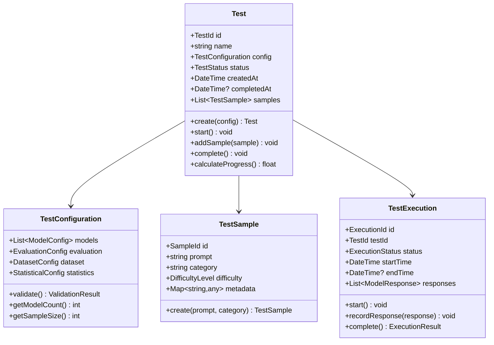
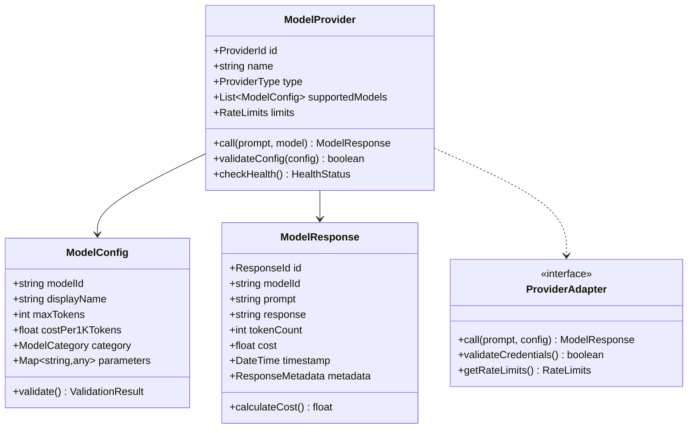
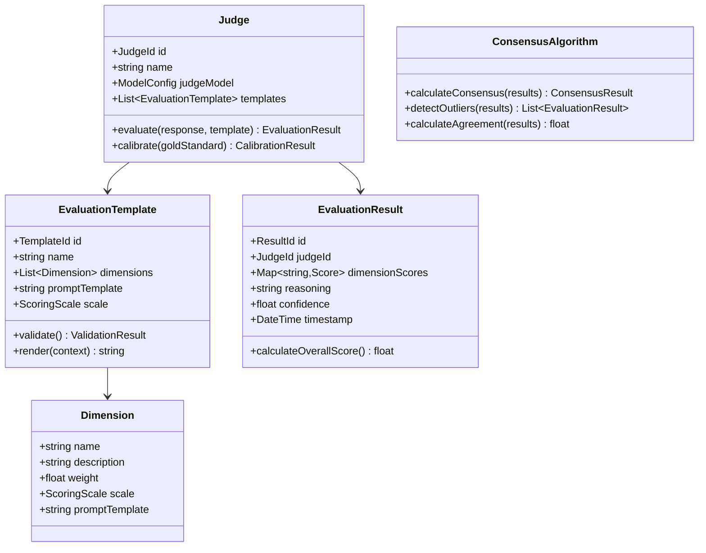
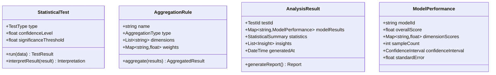

# Domain Specifications for AI Agents

## 🏗️ Test Management Domain Specification

### Domain Overview
**Bounded Context**: Test Management  
**Responsibility**: Orchestrating the complete A/B test lifecycle from configuration to completion  
**Core Concepts**: Test, TestConfiguration, TestSample, TestExecution, TestResults

### Domain Model


### Aggregate Rules
1. **Test Aggregate**: Root entity managing entire test lifecycle
2. **Invariants**: 
   - Test cannot be started without valid configuration
   - Samples cannot be modified after test starts
   - Test cannot be completed until all evaluations finish
3. **Events**: TestCreated, TestStarted, SampleAdded, TestCompleted

### Value Objects
```yaml
TestStatus:
  values: [DRAFT, CONFIGURED, RUNNING, COMPLETED, FAILED, CANCELLED]
  
DifficultyLevel:
  values: [EASY, MEDIUM, HARD]
  
ValidationResult:
  properties:
    - isValid: boolean
    - errors: List<string>
    - warnings: List<string>
```

### Repository Interface
```python
class TestRepository(ABC):
    async def save(self, test: Test) -> None
    async def find_by_id(self, test_id: TestId) -> Optional[Test]
    async def find_by_status(self, status: TestStatus) -> List[Test]
    async def find_active_tests(self) -> List[Test]
```

---

## 🤖 Model Provider Domain Specification

### Domain Overview
**Bounded Context**: Model Provider  
**Responsibility**: Managing LLM provider integrations and model response handling  
**Core Concepts**: ModelProvider, ModelConfig, ModelResponse, ProviderAdapter

### Domain Model


### Provider Implementations Required
1. **OpenAI Adapter**: GPT-4, GPT-3.5-turbo
2. **Anthropic Adapter**: Claude 3.5 Sonnet, Claude 3 Haiku
3. **Google Adapter**: Gemini Pro, Gemini Flash
4. **Baidu Adapter**: Wenxin models
5. **Alibaba Adapter**: Qwen models

### Value Objects
```yaml
ProviderType:
  values: [OPENAI, ANTHROPIC, GOOGLE, BAIDU, ALIBABA, CUSTOM]
  
ModelCategory:
  values: [PREMIUM, STANDARD, ECONOMY, EXPERIMENTAL]
  
HealthStatus:
  values: [HEALTHY, DEGRADED, UNHEALTHY, UNKNOWN]
  
RateLimits:
  properties:
    - requestsPerMinute: int
    - tokensPerMinute: int
    - dailyLimit: int
```

### Service Interface
```python
class ModelProviderService:
    async def call_model(
        self, 
        provider_id: ProviderId, 
        model_id: str, 
        prompt: str,
        **kwargs
    ) -> ModelResponse
    
    async def get_available_models(self, provider_id: ProviderId) -> List[ModelConfig]
    async def validate_provider_config(self, config: dict) -> ValidationResult
```

---

## ⚖️ Evaluation Domain Specification

### Domain Overview
**Bounded Context**: Evaluation  
**Responsibility**: Multi-judge evaluation system with consensus building  
**Core Concepts**: Judge, EvaluationTemplate, EvaluationResult, ConsensusAlgorithm

### Domain Model


### Evaluation Dimensions (Configurable)
```yaml
quality_dimensions:
  accuracy:
    description: "Factual correctness and truthfulness"
    scale: "1-5"
    weight: 0.3
    
  relevance:
    description: "How well the response addresses the prompt"
    scale: "1-5" 
    weight: 0.25
    
  clarity:
    description: "Clear communication and understandability"
    scale: "1-5"
    weight: 0.25
    
  usefulness:
    description: "Practical value and actionability"
    scale: "1-5"
    weight: 0.2
```

### Multi-Judge Consensus
```python
class JudgeOrchestrator:
    async def evaluate_response(
        self,
        response: ModelResponse,
        template: EvaluationTemplate,
        judges: List[Judge]
    ) -> ConsensusResult
    
    async def check_judge_agreement(
        self,
        results: List[EvaluationResult]
    ) -> AgreementMetrics
```

---

## 📊 Analytics Domain Specification

### Domain Overview
**Bounded Context**: Analytics  
**Responsibility**: Statistical analysis, aggregation, and insights generation  
**Core Concepts**: StatisticalTest, AggregationRule, AnalysisResult, SignificanceTest

### Domain Model


### Statistical Tests Required
1. **T-Test**: Comparing means between two models
2. **ANOVA**: Comparing multiple models simultaneously  
3. **Chi-Square**: Testing independence of categorical variables
4. **Effect Size**: Cohen's d for practical significance
5. **Bootstrap**: Confidence intervals for complex statistics

### Value Objects
```yaml
TestType:
  values: [TTEST_PAIRED, TTEST_INDEPENDENT, ANOVA_ONEWAY, ANOVA_REPEATED, CHI_SQUARE, BOOTSTRAP]
  
ConfidenceInterval:
  properties:
    - lower: float
    - upper: float
    - level: float
  
SignificanceLevel:
  values: [0.01, 0.05, 0.10]
  
EffectSize:
  properties:
    - cohensD: float
    - interpretation: string  # small, medium, large
```

---

## 🔧 Infrastructure Specifications

### Database Schema Requirements
```sql
-- Test Management Tables
CREATE TABLE tests (
    id UUID PRIMARY KEY,
    name VARCHAR(255) NOT NULL,
    config JSONB NOT NULL,
    status VARCHAR(50) NOT NULL,
    created_at TIMESTAMP DEFAULT NOW(),
    completed_at TIMESTAMP NULL
);

CREATE TABLE test_samples (
    id UUID PRIMARY KEY,
    test_id UUID REFERENCES tests(id),
    prompt TEXT NOT NULL,
    category VARCHAR(100),
    difficulty VARCHAR(20),
    metadata JSONB
);

-- Model Provider Tables  
CREATE TABLE model_responses (
    id UUID PRIMARY KEY,
    test_id UUID REFERENCES tests(id),
    sample_id UUID REFERENCES test_samples(id),
    provider_id VARCHAR(50),
    model_id VARCHAR(100),
    prompt TEXT,
    response TEXT,
    token_count INTEGER,
    cost DECIMAL(10,4),
    timestamp TIMESTAMP DEFAULT NOW(),
    metadata JSONB
);

-- Evaluation Tables
CREATE TABLE evaluation_results (
    id UUID PRIMARY KEY,
    response_id UUID REFERENCES model_responses(id),
    judge_id VARCHAR(100),
    template_id VARCHAR(100), 
    dimension_scores JSONB,
    reasoning TEXT,
    confidence FLOAT,
    timestamp TIMESTAMP DEFAULT NOW()
);
```

### API Endpoints Specification
```yaml
test_management_api:
  - POST /api/v1/tests: Create new test
  - GET /api/v1/tests: List all tests
  - GET /api/v1/tests/{id}: Get test details
  - PUT /api/v1/tests/{id}: Update test configuration
  - POST /api/v1/tests/{id}/start: Start test execution
  - DELETE /api/v1/tests/{id}: Delete test
  
model_provider_api:
  - GET /api/v1/providers: List available providers
  - GET /api/v1/providers/{id}/models: Get provider models
  - POST /api/v1/providers/{id}/test: Test provider connection
  
evaluation_api:
  - GET /api/v1/templates: List evaluation templates
  - POST /api/v1/templates: Create custom template
  - GET /api/v1/judges: List available judges
  
analytics_api:
  - GET /api/v1/tests/{id}/results: Get test results
  - GET /api/v1/tests/{id}/analysis: Get statistical analysis
  - POST /api/v1/tests/{id}/export: Export results
```

### Configuration Templates
```yaml
# Test Configuration Template
test_config_template:
  models:
    - provider: "openai"
      model: "gpt-4"
      sample_size: 100
      parameters:
        temperature: 0.7
        max_tokens: 1000
    - provider: "anthropic"
      model: "claude-3-5-sonnet-20241022"  
      sample_size: 100
      parameters:
        temperature: 0.7
        max_tokens: 1000
        
  evaluation:
    dimensions:
      - name: "accuracy"
        weight: 0.3
        template: "accuracy_template"
      - name: "relevance"
        weight: 0.3
        template: "relevance_template"
        
  dataset:
    source_type: "file"
    file_path: "datasets/general_qa.json"
    sample_strategy: "random"
    
  statistics:
    confidence_level: 0.95
    significance_threshold: 0.05
    minimum_effect_size: 0.2
```

This specification provides AI agents with comprehensive, actionable requirements for implementing each domain with proper boundaries, clear interfaces, and extensive testing requirements.